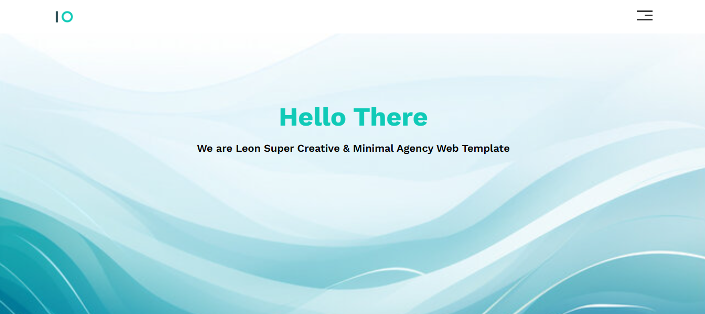
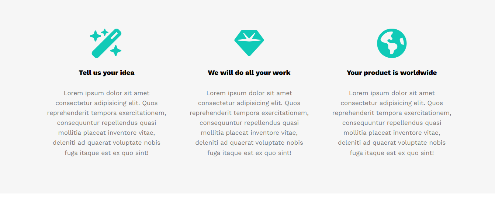
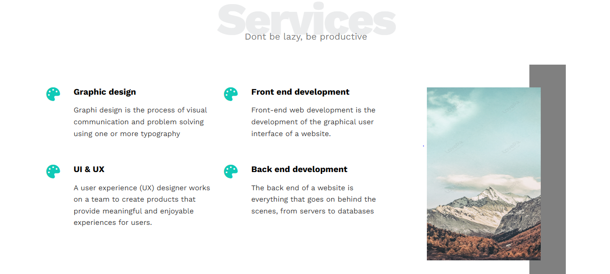
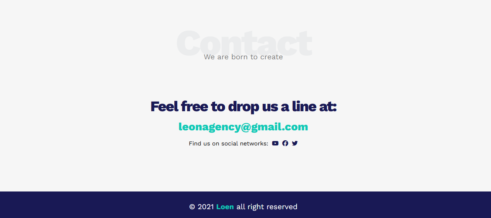
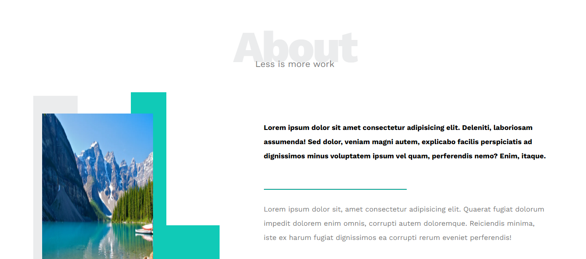

# Lorem (Landing Page)
A modern landing page
## :clipboard: Project Overview

  
  
  
  
  
  

## :sparkler: Features

  Just a simple landing page using HTML and CSS 

## :computer: Technology Stack

  
  
  

live preview: https://mostafa-ashraf0.github.io/Lorem-landing-page/
